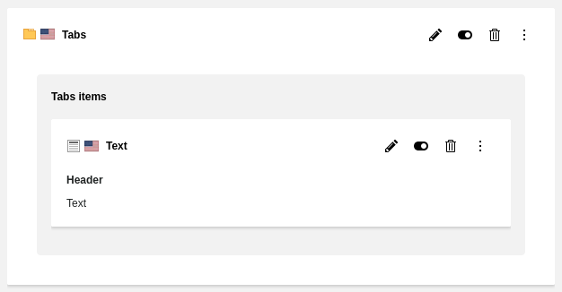

..  include:: /Includes.rst.txt
..  _cb_nestedContentElements:

=======================
Nested Content Elements
=======================

It is possible to nest Content Elements within Content Blocks.
By default, TYPO3 would render those nested elements within the TYPO3 Page
Module in the backend and the frontend output. Content Blocks delivers an API
and integration for common setups to prevent this unwanted behaviour.

..  note::

   This will not replace proper grid extensions like EXT:container, as this
   solution does not provide drag and drop or creation of new child elements
   in the Page Module.

..  _cb_nested_elements:

How to create nested Content Elements
=====================================

In order to have nested Content Elements, we need to make use of the field type
:ref:`Collection <field_type_collection>`. This field type allows us to have a
relation to another table. In our case :sql:`tt_content`.

..  code-block:: yaml
    :caption: EXT:my_extension/ContentBlocks/ContentElements/tabs/config.yaml

    name: example/tabs
    fields:
      - identifier: header
        useExistingField: true
      - identifier: tabs_item
        type: Collection
        minitems: 1
        foreign_table: tt_content
        allowedRecordTypes:
          - example_text

This config creates a field, where you can create new Content Elements within
your root Content Element. With the option
:ref:`allowedRecordTypes <confval-collection-allowedRecordTypes>` it is possible
to restrict certain Content Types.

..  _cb_nested_elements_frontend:

Render nested Content Elements in the frontend
==============================================

There are two ways to render nested Content Elements. The first one is to reuse
the basic rendering definition of the child element. This is already
pre-rendered in the Fluid variable `{data._grids.identifier}`. This variable
contains all relations which might have a frontend rendering definition defined
in TypoScript. Normally, these are only Content Elements.

..  code-block:: html
    :caption: EXT:my_extension/ContentBlocks/ContentElements/tabs/templates/frontend.html

    <f:for each="{data._grids.tabs_item}" as="item" iteration="i">
        <f:comment><!-- {item.data} contains the Content Block data object. --></f:comment>
        

            <f:comment><!-- {item.content} contains the rendered html. --></f:comment>
            <f:format.raw>{item.content}</f:format.raw>
        

    </f:for>

..  note::

   This is the same as triggering the rendering with :html:`f:cObject` view
   helper:

   ..  code-block:: html

       <f:cObject typoscriptObjectPath="tt_content.example_text" table="tt_content" data="{data}"/>

The second method is to define an alternative rendering within your Fluid
template. This means you can have a default rendering definition for your
Content Element, when used as a root Content Element and an alternative one if
used as a child. This method is a lot more flexible, but requires a little bit
more work.

..  code-block:: html
    :caption: EXT:my_extension/ContentBlocks/ContentElements/tabs/templates/frontend.html

    <f:for each="{data.tabs_item}" as="item" iteration="i">
        

            <h2>{item.header}</h2>
            <f:format.html>{data.bodytext}</f:format.html>
        

    </f:for>

..  tip::

    You can also use :ref:`global partials <cb_extension_partials>` for the
    second method to have less duplication.

..  _cb_nested_elements_backend:

Render nested Content Elements in the backend
=============================================

Similarly to frontend rendering, it's also possible to render nested content in
the backend. For this Content Blocks provides ready to use Fluid partials which
are able to render backend previews the same way the Core page layout does it.

..  code-block:: html
    :caption: EXT:my_extension/ContentBlocks/ContentElements/tabs/templates/backend-preview.html

    <f:render partial="PageLayout/Grid" arguments="{data: data, identifier: 'tabs_item'}"/>

The partial is called **PageLayout/Grid** and accepts your current Content Block
data object as well as the identifier of the Collection field, which you want
to render.

    The partial renders the grid layout from the Core.

This preview is limited to control buttons like edit, delete and hide. No
support for drag and drop or creation of new child elements is given.

..  _cb_share_options_explanation:

`shareAcrossFields` and `shareAcrossTables`
===========================================

There are two options :ref:`shareAcrossFields <confval-collection-shareAcrossFields>` and
:ref:`shareAcrossTables <confval-collection-shareAcrossTables>`, which you might need when working
with Nested Content Elements.

.. warning::

   If you forgot to set these options when it would be necessary, the nested elements will
   appear twice in the backend. If you are unsure, always enable these options. In worst
   case you will have redundant information in the database.

First, `shareAcrossFields` is needed, if you have two or more Collections with a
**shared** `foreign_table` inside the **same** Content Block. In this case `tt_content`.
So for example you have a field :yaml:`nested_elements_a` and :yaml:`nested_elements_b`
inside the same Content Element. In order to distinguish them, a new database column
will be created to track the field name of the corresponding Collection.

..  code-block:: yaml
    :caption: EXT:my_extension/ContentBlocks/ContentElements/nested-content/config.yaml

    name: example/nested-content
    fields:
      - identifier: header
        useExistingField: true
      - identifier: nested_elements_a
        type: Collection
        foreign_table: tt_content # This table is used twice here.
        shareAcrossFields: true   # That's why shareAcrossFields must be enabled.
      - identifier: nested_elements_b
        type: Collection
        foreign_table: tt_content # This table is used twice here
        shareAcrossFields: true   # That's why shareAcrossFields must be enabled.

The option `shareAcrossTables` on the other hand is only necessary, if the same
`foreign_table` is **shared** across multiple tables. So for example you use
nested Content Elements in a Content Element and a second time in a custom
Record Type like `news`.

..  code-block:: yaml
    :caption: EXT:my_extension/ContentBlocks/ContentElements/nested-content/config.yaml

    name: example/nested-content
    fields:
      - identifier: header
        useExistingField: true
      - identifier: nested_elements
        type: Collection
        foreign_table: tt_content # This table is also used in news
        shareAcrossTables: true   # That's why shareAcrossTables must be enabled.

..  code-block:: yaml
    :caption: EXT:my_extension/ContentBlocks/RecordTypes/news/config.yaml

    name: example/news
    table: my_news_table
    fields:
      - identifier: title
        type: Text
      - identifier: nested_elements
        type: Collection
        foreign_table: tt_content # This table is also used in nested-content
        shareAcrossTables: true   # That's why shareAcrossTables must be enabled.

Of course, if both cases are true, both options must be enabled.

..  _cb_nested_vs_container:

When to use nested Content Elements vs. container extensions
============================================================

Many problems can be solved with either solution. However, as a rule of thumb,
as soon as you need dynamic multi-grid components for your page, you are better
off using something like EXT:container. For example "Two-Column container",
"1-1-2 Container" or "Wrapper Container".

On the other hand, if you create a self-contained element, which should hold
child Content Element relations and these child elements are unlikely to be
moved elsewhere, you might be better off using simple nested Content Elements.
An example could be a "Tab module" or a "Content Carousel".

..  _cb_nested_concept:

Concept
=======

The nesting is done via one :confval:`database field <collection_foreign_field>`
holding a reference to the parent Content Element. The :sql:`colPos` column will
always be `0`, which is also the reason why it would otherwise be rendered by
TYPO3 even though created within another Content Element.

Extensions like EXT:container work completely different as they assign a
specific colPos value to the child elements.

..  _cb_nesting_prevent_output_fe:

Preventing output in frontend
=============================

Output in frontend is prevented by extending :typoscript:`styles.content.get.where`
condition. This is done via :typoscript:`postUserFunc`, which will extract all
defined parent reference columns. Those are added to the SQL statement in order
to prevent fetching any child elements.

..  note::

    If you do not build upon :typoscript:`styles.content.get` or the
    :php-short:`TYPO3\CMS\Frontend\DataProcessing\PageContentFetchingProcessor`,
    you need to integrate the logic yourself. The necessary API providing all
    the columns is available via :php:`TYPO3\CMS\ContentBlocks\UserFunction\ContentWhere->extend`.
    This can be used to apply the same approach to :php-short:`TYPO3\CMS\Frontend\DataProcessing\DatabaseQueryProcessor`.

    Example:

    ..  code-block:: typoscript

        20 = CONTENT
        20 {
          table = tt_content
          select {
            where = {#colPos}={register:colPos}
            where.insertData = 1
            where.postUserFunc = TYPO3\CMS\ContentBlocks\UserFunction\ContentWhere->extend
          }

..  _cb_nesting_prevent_output_be:

Preventing output in backend
============================

TYPO3 provides an event to alter the SQL query to fetch content for the Page
Module in the backend. Content Blocks adds an event listener to apply the same
logic as for the frontend.
