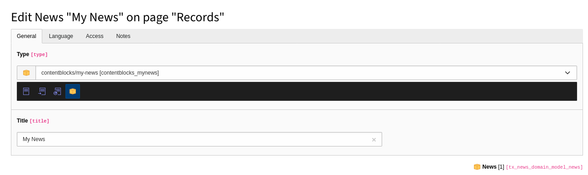

.. include:: /Includes.rst.txt
.. _cb_guides_record_types:

============
Record Types
============

Record Types are generic Content Types in TYPO3. Basically everything, which is
not a Content Element or Page Type. Adding custom records requires you to define
a :yaml:`table` name. A minimal example looks like this:

.. code-block:: yaml
   :caption: EXT:your_extension/ContentBlocks/RecordTypes/my-record-type/config.yaml

    name: example/my-record-type
    table: tx_vendor_my_record_type
    labelField: title
    fields:
      - identifier: title
        type: Text

This example will create a new table :sql:`tx_vendor_my_record_type`. Usually
Record Types are added in folders, so you first have to create a new folder in
the page tree. After that, you can switch to the **List** module and click
"Create new record". There you will find your newly created Record Type.

.. tip::

    If you prefix your table with `tx_`, TYPO3 will assume this record belongs
    to an extension and will group it separately by the extension title. This is
    either taken from `ext_emconf.php` (title) or `composer.json` (description).
    Otherwise, the record will be grouped under "System Records".

It is also possible to allow creation of Record Types in normal pages. For that
you have to enable :yaml:`ignorePageTypeRestriction`:

.. code-block:: yaml
   :caption: EXT:your_extension/ContentBlocks/RecordTypes/my-record-type/config.yaml

    name: example/my-record-type
    table: my_record_type
    labelField: title
    security:
      ignorePageTypeRestriction: true
    fields:
      - identifier: title
        type: Text

.. _yaml_reference_record_type_multiple_types:

Multi Type Record
=================

In order to create multiple types for a single Record Type, it is required to
define a :yaml:`typeField` field and a :yaml:`typeName`. The type field will be
created automatically and added as the very first field in your editing
interface as a select dropdown. The different types will be also added
automatically to the list:

.. code-block:: yaml
   :caption: EXT:your_extension/ContentBlocks/RecordTypes/diver/config.yaml

    name: example/diver
    table: person
    typeField: type
    typeName: diver
    fields:
      - identifier: title
        type: Text

.. code-block:: yaml
   :caption: EXT:your_extension/ContentBlocks/RecordTypes/instructor/config.yaml

    name: example/instructor
    table: person
    typeField: type
    typeName: instructor
    fields:
      - identifier: title
        type: Text

Avoiding redundancy
-------------------

Whenever you have multiple types for a table, you run into the problem on where
to define the global capability options like :yaml:`languageAware`,
:yaml:`workspaceAware` or :yaml:`labelField` to name a few. Normally it's
recommended to keep this configuration in sync between all Content Blocks. The
reason behind this is, if you remove one type, the other Content Block still
works independently. However, this can cause heavy redundancy. Especially if
you are disabling a lot of options. The solution is to declare one of the types
as the "default" type. This is done simply by giving it the highest
:yaml:`priority`. This ensures this Content Block is loaded first and sets the
configuration for all other types.

.. code-block:: yaml
   :caption: EXT:your_extension/ContentBlocks/RecordTypes/default/config.yaml

    name: example/default
    table: my_record
    priority: 999
    typeField: type
    typeName: default
    languageAware: false
    workspaceAware: false
    labelField: title
    fields:
      - identifier: title
        type: Text

.. code-block:: yaml
   :caption: EXT:your_extension/ContentBlocks/RecordTypes/special/config.yaml

    name: example/special
    table: my_record
    typeName: special
    fields:
      - identifier: title
        type: Text

.. _yaml_reference_record_type_in_collection:

Use as child table in Collection
================================

It is possible to create a new Record Type, which is used as a child table
inside a Collection. This is simply done by defining
:confval:`foreign_table <collection-foreign-table>` inside the Collection.
This concept also works for type :ref:`Select <field_type_select>` (foreign_table)
and type :ref:`Relation <field_type_relation>` (allowed). The only difference is
that you reference existing records instead of creating new ones.

.. code-block:: yaml

    name: example/slide
    table: my_slide
    labelField: title
    fields:
      - identifier: title
        type: Text
      - identifier: image
        type: File

.. code-block:: yaml

    name: example/collection
    fields:
      - identifier: slides
        type: Collection
        foreign_table: my_slide
        shareAcrossTables: true
        shareAcrossFields: true

Adding new types to existing tables
===================================

Content Blocks allows to extend existing table definitions with custom types.
For this to work, the table in question needs to define :ref:`type field <t3tca:ctrl-reference-type>`.
Create a new Record Type and define the :yaml:`table`, which you want to extend.
In addition, you can set a fixed :yaml:`typeName` if you wish. In this example
we extend the News records with a custom type:

.. code-block:: yaml
   :caption: EXT:your_extension/ContentBlocks/RecordTypes/my-news-record/config.yaml

    name: example/my-news-record
    table: tx_news_domain_model_news
    typeName: my_news_record
    fields:
      - identifier: title
        useExistingField: true

   The News record is extended with a custom type.

Content Blocks will automatically create the necessary system field tabs and
palettes based on the TCA definition. You just have to define your desired
custom fields.

Keep in mind that you probably need to include various required fields like
path_segment, datetime or bodytext for your News record to work properly within
the extension. This is not a complete guide on how to make custom records work
for third-party extbase extensions. Refer to the documentation of those
extensions for additional steps. This replaces every step which includes TCA
overrides.

With this method it is not possible to override the capabilities of the existing
table. This includes options like :yaml:`languageAware`, :yaml:`workspaceAware`
or :yaml:`labelField` to name a few.

.. hint::

   It's not possible to extend existing types with additional fields. This
   violates the concept of self-contained Content Blocks. If you need custom
   fields, create a custom type instead.
