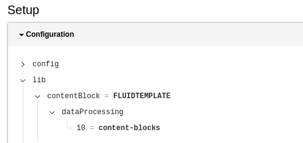

.. include:: /Includes.rst.txt

.. _fsc-guide:

============================
Fluid Styled Content Layouts
============================

This guide describes how you can extend your Content Block templates with the
layout from the **fluid_styled_content** system extension.

You probably know, that fluid styled content (from now on abbreviated FSC) adds
special wrappers for its content elements like this:

.. code-block:: html

   

These are very helpful, because you can use the anchor id and spacing classes of
FSC. In order to wrap all your templates with such a layout you have to provide
the FSC layout paths for :typoscript:`lib.contentBlock`.

Let's have a look at the contents of this TypoScript object:

   The contents of lib.contentBlock

As you can see :typoscript:`lib.contentBlock` is a :typoscript:`FLUIDTEMPLATE`
TypoScript content object. This means you can override it with your own
layout and partial root paths.

.. code-block:: typoscript

   lib.contentBlock {
       partialRootPaths.0 < lib.contentElement.partialRootPaths.0
       layoutRootPaths.0 < lib.contentElement.layoutRootPaths.0

       settings < lib.contentElement.settings
   }

By adding the FSC settings, these will also be available in your Content Block
templates.

.. important::

   We use the key "0" here, so FSC will never override your own layouts and
   partials.

In order to use the standard FSC fields, you should include them as Basics in
your EditorInterface.yaml file. These are already shipped by Content Blocks.

.. code-block:: yaml
   :caption: EXT:your_extension/ContentBlocks/ContentElements/fsc-test/EditorInterface.yaml

    name: vendor/fsc-test
    title: FSC Element
    basics:
      - TYPO3/Appearance
    fields:
      - identifier: TYPO3/Header
        type: Basic

Now the setup is complete and all what's left to do is to use the newly
available layout in your Frontend.html templates.

.. code-block:: html
   :caption: EXT:your_extension/ContentBlocks/ContentElements/fsc-test/Source/Frontend.html

   <f:layout/>

   <!-- This removes the <header> partial of FSC -->
   <f:section name="Header"/>

   <f:section name="Main">
       <!-- Your content -->
   </f:section>

This is of course completely optional and you can just remove this per element
if you need to. The additional empty :html:`<f:section name="Header"/>` is
important: This removes the :html:`<header>` partial which FSC would add to your
template. If you need this anyway, you can just remove it.

.. important::

   :html:`<f:layout/>` is the same as :html:`<f:layout name="Default"/>`. If you
   also have a Layout with the name `Default.html` defined in **Layouts**, this
   will override the FSC Layout.
