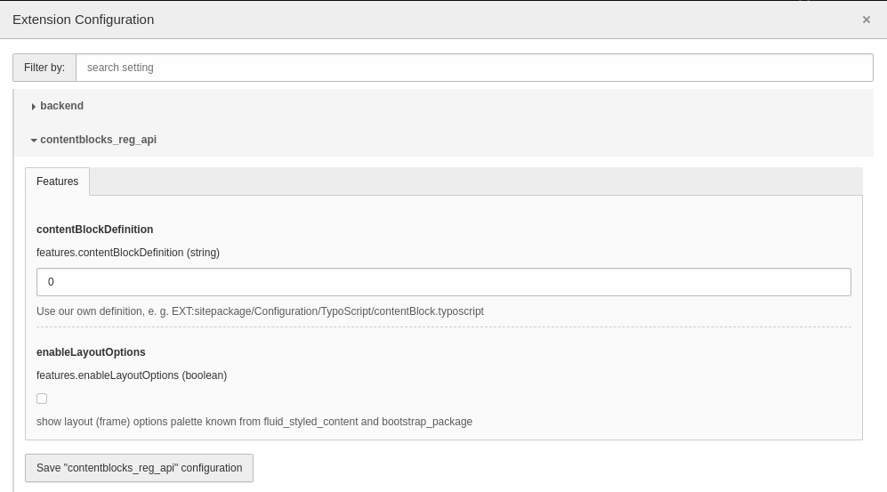

.. include:: /Includes.rst.txt
.. _extension_installation:

============
Installation
============

Using Composer:

.. code-block:: shell

    composer require typo3/cms-content-blocks

For installations that don't use Composer, activate the Content Blocks extension
in the Extension Manager.

Extension configuration
=======================

If you need to inherit Content Blocks from your own definition (e. g. if you want
to inherit Content Blocks from lib.contentElement), you can extend the default
TypoScript as you need.

The default code looks like this:

.. code-block:: typoscript

   lib.contentBlock = FLUIDTEMPLATE
   lib.contentBlock {
       layoutRootPaths {
           -5 = EXT:content_blocks/Resources/Private/Layouts/
       }

       partialRootPaths {
           0 = EXT:content_blocks/Resources/Private/Partials/
       }

       dataProcessing {
           10 = TYPO3\CMS\\ContentBlocks\DataProcessing\CbProcessor
       }
   }

.. attention::
   If you change the code, you are responsible for the code to be working.
   Beware of data processing. Your Content Block won't work without that.

You can inject your code via the extension settings in the install tool.
There you can set the default TypoScript to your specific file like
`EXT:your_sitepackage/Configuration/TypoScript/contentBlock.typoscript`.

If you are using `EXT:fluid_styled_content` or `EXT:bootstrap_package`, enable
the frame pallet in the appearance section in the extension configuration:

   Extension configuration for EXT:content_blocks in "Configure Extensions"
   of backend module "Settings"
