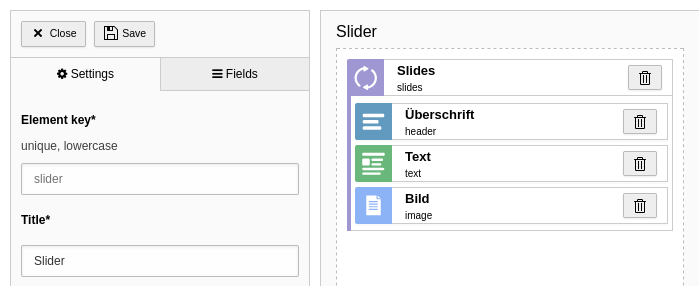

.. include:: /Includes.rst.txt
.. _migrations-mask:

====
Mask
====

The popular Mask extension is one of the most used extensions in TER. With over
one million downloads on packagist it served their users well. Content Blocks
is heavily inspired by Mask's architecture. In fact, it could be called the
successor of Mask. The combination of Mask and the concept of a Content Block
is the result of this extension. Due to this, the migration is quite simple and
doesn't even require database migrations.

.. note::

   This guide assumes you are on the latest Mask version v8 and TYPO3 v12.

Manual migration
================

As of now, there is no automatic migration from Mask to Content Blocks. This
might come in the future. For now, let's see how to do the migration manually.
The advantage is that you might better understand how the extension works.
Install Content Blocks in parallel to Mask and follow the steps below.

Recreation of a Mask Element
----------------------------

   Example Mask slider element

First, let's create a new Content Block for the Mask Element you want to
migrate. For this, run the command :bash:`make:content-block` and create a
Content Element with a vendor and name of your choice. The name can be the same
as the Mask name, but doesn't have to.

Next, you need to override the :yaml:`typeName` and disable prefixing. In this
example our Mask element has the name `slider`, so :yaml:`typeName` must be set
to `mask_slider`. This is the CType, which Mask generates in the background. If
you don't set this option, Content Blocks would create a unique identifier from
vendor and name, which you don't want in this case. We disable prefixing, so we
can adopt the existing Mask fields.

.. code-block:: yaml
   :caption: EXT:site_package/ContentBlocks/ContentElements/slider/EditorInterface.yaml

    name: tx-mask/slider
    typeName: mask_slider
    prefixFields: false

Our Mask element has a repeating slides field. This is a Collection in terms of
Content Blocks. To adopt this field, we have to set the identifier prefixed with
`tx_mask`. Also, :yaml:`foreign_field` has to be set explicitly to
:yaml:`parentid`, as this is the column name, which Mask uses for its parent
reference field.

All other fields can be re-defined in Content Blocks as usual. Don't forget
to prefix **all** fields with `tx_mask`, even inside Collections.

.. code-block:: yaml
   :caption: EXT:site_package/ContentBlocks/ContentElements/slider/EditorInterface.yaml

    name: tx-mask/slider
    typeName: mask_slider
    prefixFields: false
    fields:
      - identifier: tx_mask_slides
        type: Collection
        foreign_field: parentid
        fields:
          - identifier: tx_mask_header
            type: Textarea
          - identifier: tx_mask_text
            type: Textarea
            enableRichtext: true
          - identifier: tx_mask_image
            type: File

Templates
---------

This is the easy part. Simply copy the Mask template into **Frontend.html** and
you are done. That said, if you didn't use any partials or layouts. If so, move
these to the according **Source/Partials** and **Source/Layouts** folder in your
Content Block.

Icon
----

In case you've used a custom SVG icon for the Mask Element, you can rename it
to **Icon.svg** and move it to the **Assets** folder. For FontAwesome icons you
can download the SVG version from the official website.

Labels
------

Mask doesn't have a translation feature. Labels can be copied from the backend
module view, and pasted directly into the **Labels.xlf** file.

.. tip::

    Use the :ref:`command <command_language_generate>`
    :bash:`content-blocks:language:generate` to automatically generate the
    **Labels.xlf** file with automatic keys prefilled.

Finish
------

That's mostly it. Now you can purge your Mask element in the backend module view
and everything should work as before. Repeat the migration for every Mask
Element and you can uninstall the Mask extension in the end and say farewell.

.. note::

    In the backend preview of your element you will see
    `Element "xxx" is missing in Mask definition.`. This message will vanish as
    soon as you uninstall the Mask extension.

Limitations
===========

There are some very special Mask features, which didn't make the cut to Content
Blocks (for good reason).

Page templates fields
---------------------

Mask has this quirky feature of assigning additional page fields based on TYPO3
backend layouts. Historically, frontend page templates are bound to backend
layouts. This is a conceptual mistake, which still persists. Anyway, there is
no such feature in Content Blocks. Use custom page types instead and migrate
pages with special backend layouts to the new doktype.

Nested Content
--------------

Technically, nested content means the table tt_content has a relation to itself.
This can be achieved with Content Blocks as well with the
:ref:`help of Collections <cb_nestedContentElements>`. However, the approach is
slightly different. Mask sets the fixed value **999** for the **colPos** field
of child elements. All elements with this colPos value are simply hidden from
the backend with a hook. Naturally, they won't appear in the frontend, as this
colPos is usually not rendered. In contrast, Content Blocks uses the existing
parent reference field to systematically determine the status of a child field.
This method is far more superior as it doesn't force a random colPos value.

You do the migration as described with Collections above. In addition, you have
to add some more config.

.. code-block:: yaml
   :caption: EXT:site_package/ContentBlocks/ContentElements/nested-content/EditorInterface.yaml

    name: tx-mask/nested-content
    typeName: mask_nested_content
    prefixFields: false
    fields:
      - identifier: tx_mask_content
        type: Collection
        foreign_table: tt_content
        foreign_field: tx_mask_content_parent_uid
        foreign_table_field: tx_mask_content_tablenames
        foreign_match_fields:
          tx_mask_content_role: tx_mask_content

The limitation is, that you can't add constraints to the available CTypes in the
child field. However, you can set a default value.

.. code-block:: yaml
   :caption: EXT:site_package/ContentBlocks/ContentElements/nested-content/EditorInterface.yaml

    name: tx-mask/nested-content
    typeName: mask_nested_content
    prefixFields: false
    fields:
      - identifier: tx_mask_content
        type: Collection
        foreign_table: tt_content
        foreign_field: tx_mask_content_parent_uid
        foreign_table_field: tx_mask_content_tablenames
        foreign_match_fields:
          tx_mask_content_role: tx_mask_content
        overrideChildTca:
          columns:
            CType:
              config:
                default: text

Disable Content Elements
------------------------

With Mask, you could disable certain Mask Elements so they won't appear in the
Content Element Wizard. This is not possible with Content Blocks. All defined
Content Blocks are always available. The migration is to delete those unused
elements, or restrict the usage through backend user permissions.
